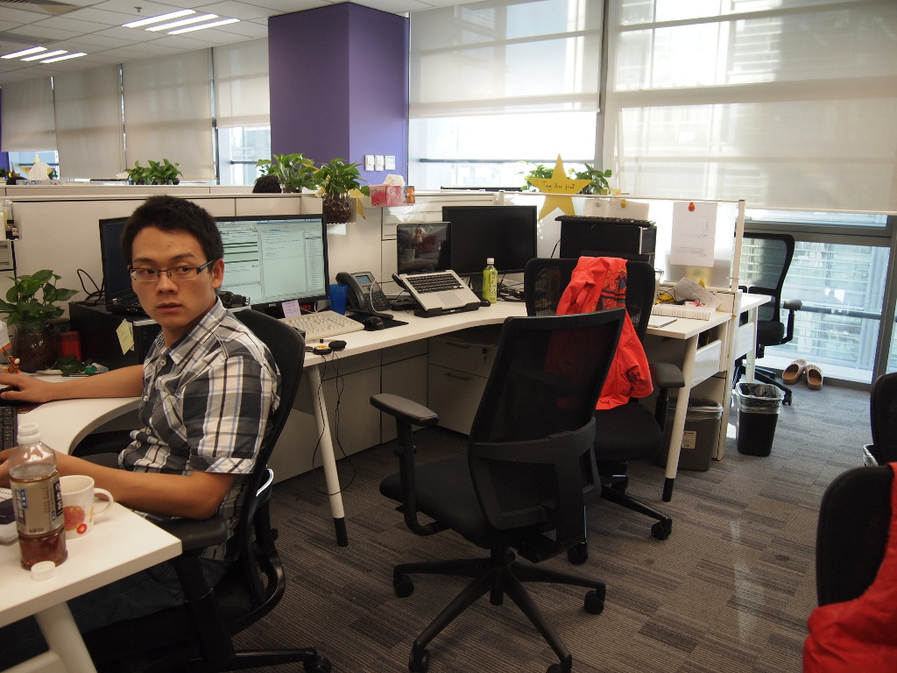

# 懒猫往事
Note: All characters appearing in this work are fictitious. Any resemblance to real persons, living or dead, is purely coincidental.

## 华丽
进懒猫以前我从来没有接触过Linux，人对于自己的无知有两种态度：洋洋自得和过度恐惧。我属于后一种。而华丽就是我的老师。

2011年的懒猫还在清华科技园办公。记忆中清华科技园是个阴冷潮湿的地方。之所以阴冷是因为入职的时候正直春夏，空调大开阴风刺骨。整个楼是灰色的，地毯的灰色的，窗帘紧闭。楼道中是烟民的聚集地。通风扇里面吹来的是湿润的空气。一股男生宿舍的味道。当时的工作环境尴尬而紧凑。

> 左边是曹磊，我在中间，右面就是华丽的位置。三个人挤在一起却除了工作上的内容很少说其他的。每天中午12点准时去吃饭，饭后大概有20分钟可以浏览网页和新闻。这大概与A和J同学坐得比较近有关。椅子上搭着的粉红卫衣是华丽的。她通常会用卫衣帽子反向套住头小睡上10分钟。虽然只有10分钟，也是需要勇气和胆量的。如果过了13：10分还没有起来，那就比较危险了。彼时我们都入职没多久，工作中多是含着忐忑。曹磊算是元老了，和他也学了不少。

当时懒猫流行的开发模式是“Train Mode”。所谓火车模式就是每个月定期交付一部分功能到生产环境上。这种方式乍一看是非常完美的：一，火车模式具备了敏捷开发的定期交付特征；二，如果相关功能没有通过测试那么可以等待下一个提交点的到来。这样整个团队在一个月的时间周期里面所完成的工作量就可以精确的度量。如果没有通过测试也比较坦然，等下一班就好了。那个时候对于开发人员的四个星期是：第一周做计划；二三周写代码；第四周提交给测试并上线。理论上对于测试人员是：一二周做测试计划和设计评审；三周跟进开发进行初步测试；第四周协调上线以及生产环境的验证。

看似轻松的工作隐藏着阴谋。第一，没人告诉你铁轨有好几条。第二，火车虽然不想晚点，但是乘客有可能上不去被卡在门上，于是不能开车。第三，如果单次乘客上的太少老大脸上肯定不好看。第四，每次功能的提出其实是有隐含的时间要求的，所以经常不能等下一班。第五，工程师是月度计划，失去的了执行力的敏捷性。于是Train Mode的结果是各趟火车横七竖八的趴在铁轨上转悠。周围是茫茫碌碌的乘客上蹿下跳。火车走走停停不时倒车。场面甚是欢乐。

大家都那么忙，于是软件质量就没有保障了。工作状态变成了：第一二周给项目擦屁股，也许是几个；第三周做本月的计划听别人发牢骚；第四周是忙碌的冒烟测试。由于大部分项目是从美国那边接手的，稍有闪失就能浪费几天的时间。于是乎一个好主意出现了：Scrum！让MM(Manger & Meeting)张牙舞爪起来！于是华丽每天要参加3次Scrum meeting,好像赶集一般。每个Scrum meeting的宗旨是：但凡相关的人都要来。办公室处处洋溢着紧张的气氛，敏捷开发的的最大优势立刻彰显：会议室不够用了。

## 保龄球
地滚球总是在地上跑，虽然身材不高但是速度可不慢。尤其在强调执行效率的公司，说话快、走路快就好像你的思维也很快一样。第一次见到保龄球也是这样的印象：来的比领导早走的比领导晚；7*24穿插在会议室和会议中；眼角的余光不断扫射力图超越每一个在走廊上遇到的同事。懒猫有网站叫“经理中心”，其中记录了各种坑蒙拐骗的绝技，只要肯用心去读不用自宫也能成功。保龄球自然深得其中精髓。比如，他从来不说什么东西不好。再比如，他虽然鄙视(╬▔皿▔)凸你但也只是侧脸窃笑，嘴上可是一套道貌岸然。再再再比如，他将一盆屎扣在你头上时也是义正言辞义愤填膺，仿佛那屎才是他真正要讨伐的。